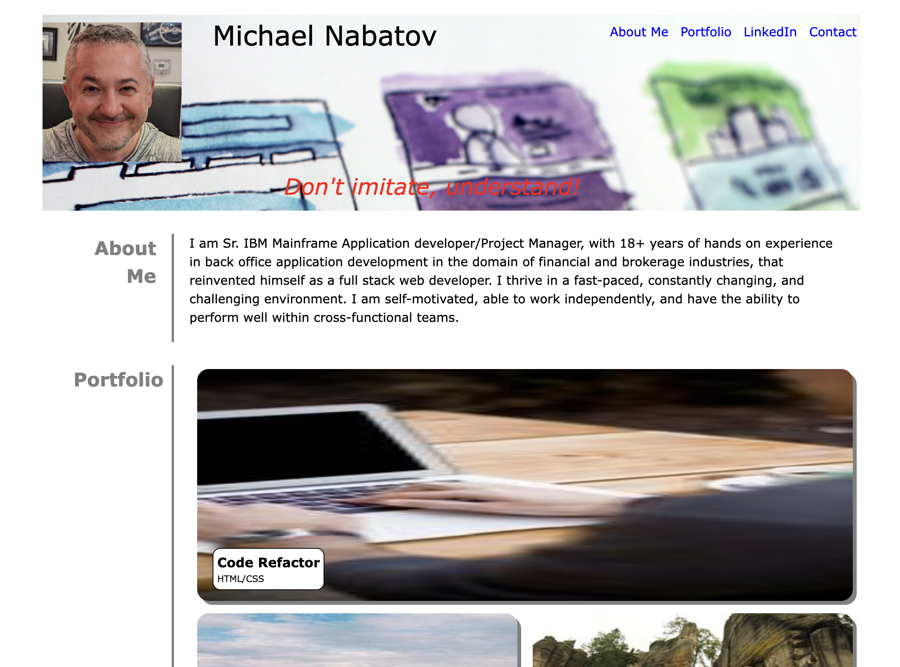

# Professional Portfolio

## Description

This site showcases various projects which demonstrate my aptitude of full stack technologies. It contains a portfolio of several selected projects, presented in card layout, with links to the deployed site.  Future projects that are yet to be developed are marked as such with a disclaimer.  There is also a quote of the day which scrolls across the screen, designed to inspire future developers. 

At the bottom of the site, there is a Contact Me section, which is designed for future employers to easily contact me. In addition, there are links to GitHub, Twitter, and SoundCloud sites. These contain my deployed projects, my social media profile, and my musical works of art.  The application runs on most mobile devices as well as desktop.

---

## Usage

To visit site, navigate to the following HTTP address:

[https://mikeyboxx.github.io/my-landing-page/](https://mikeyboxx.github.io/my-landing-page/)

---

## Screenshot

The following image shows the web application's appearance and functionality:

---
